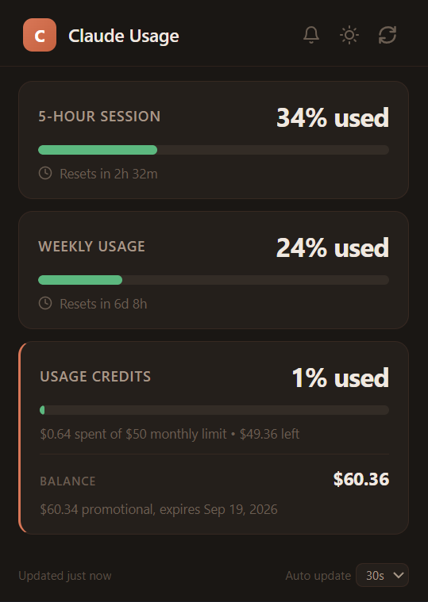

# Claude Usage Monitor — Chrome Extension

A minimal Chrome extension that shows your Claude.ai usage limits at a glance — session window, weekly caps per model, and extra usage spending — all using your existing browser session.

## Features

- **5-Hour Session** — Rolling window utilization with countdown to reset
- **Weekly Usage** — Weekly limits broken down by model (Opus, Sonnet, Cowork, OAuth Apps)
- **Dark / Light theme** toggle
- **Zero config** — Automatically detects your organization from your claude.ai session
- **Privacy-first** — No external servers, no telemetry, all data stays in your browser

## Installation

1. Download or clone this repository — if you downloaded a ZIP file, extract it first before continuing
2. (if on Chrome) Open Chrome and go to `chrome://extensions/`
3. Enable **Developer mode** (top-right toggle)
4. Click **Load unpacked** and select the extracted folder

## Usage

1. Make sure you are logged into [claude.ai](https://claude.ai) in the same browser
2. Click the extension icon in your toolbar
3. Your usage data loads automatically — click the refresh button to update

> The extension reads the `lastActiveOrg` cookie from claude.ai to identify your account. No credentials are stored or transmitted anywhere.

## Permissions

| Permission | Why |
|---|---|
| `cookies` | Read the `lastActiveOrg` cookie to detect your organization |
| `storage` | Save your theme preference (dark/light) locally |
| `host_permissions` (`claude.ai`) | Fetch usage data from the claude.ai API |

## Privacy

- All data stays local in your browser
- No external servers, no tracking, no telemetry
- Uses your existing claude.ai session cookies — nothing is stored or transmitted beyond your machine

## License

MIT — see [LICENSE](LICENSE) for details.

## Disclaimer

- This is an **unofficial**, community-built tool and is **not affiliated with or endorsed by Anthropic**.
- It relies on an internal claude.ai API endpoint that may change or break without notice.
- Use at your own risk and in accordance with [Anthropic's Terms of Service](https://www.anthropic.com/terms).
